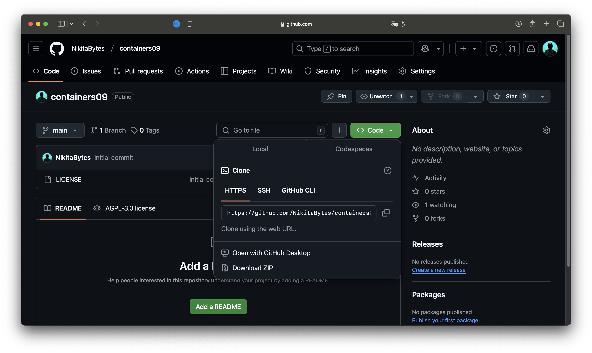
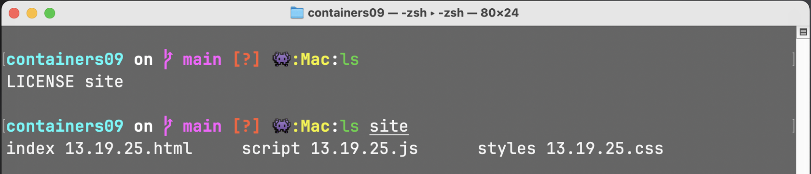
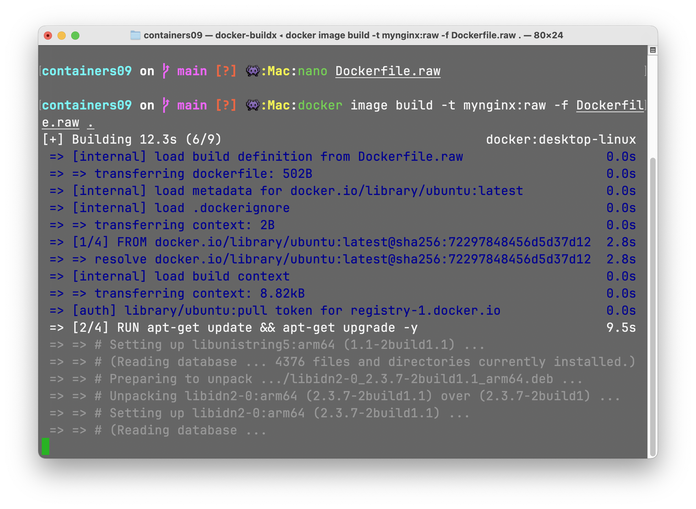
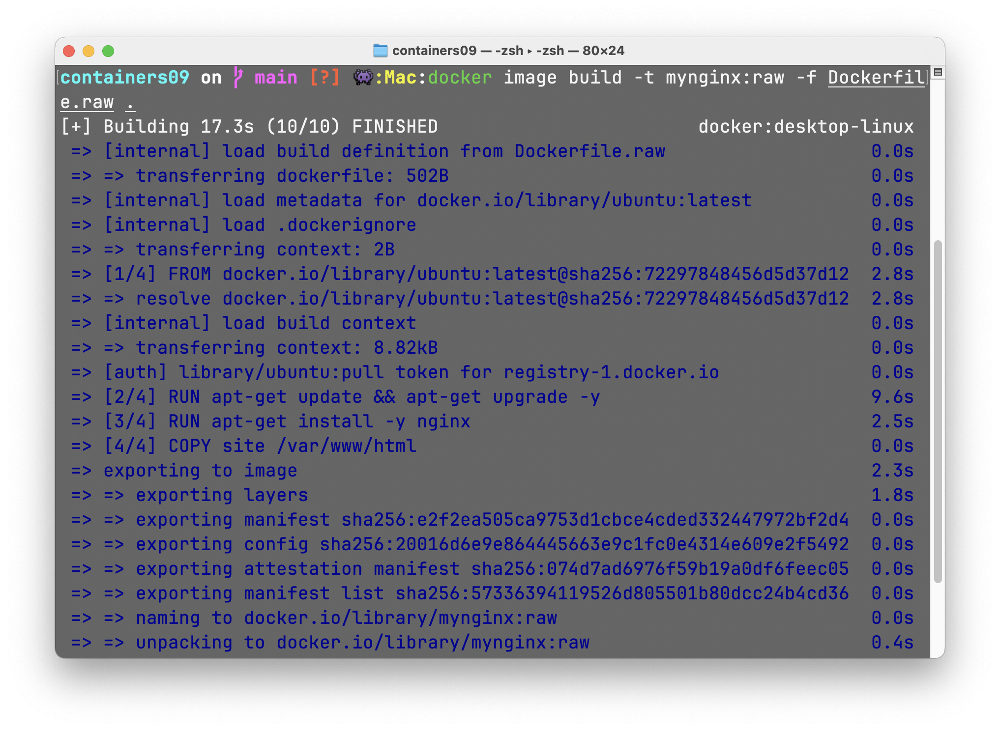
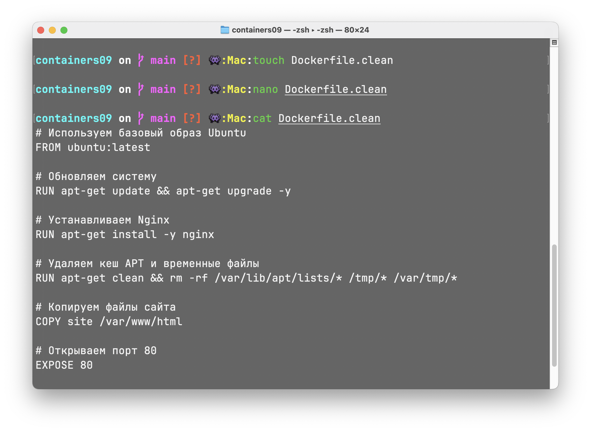
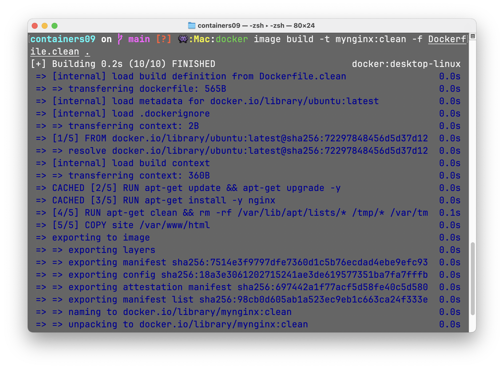
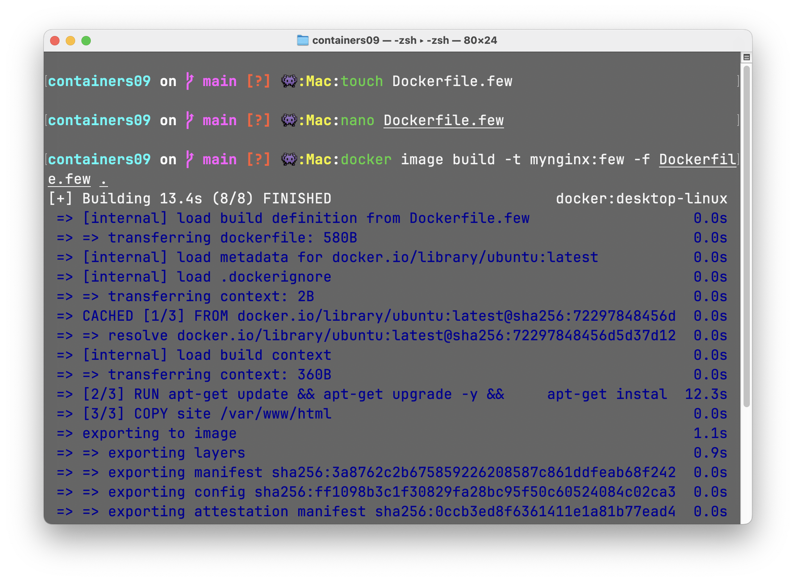
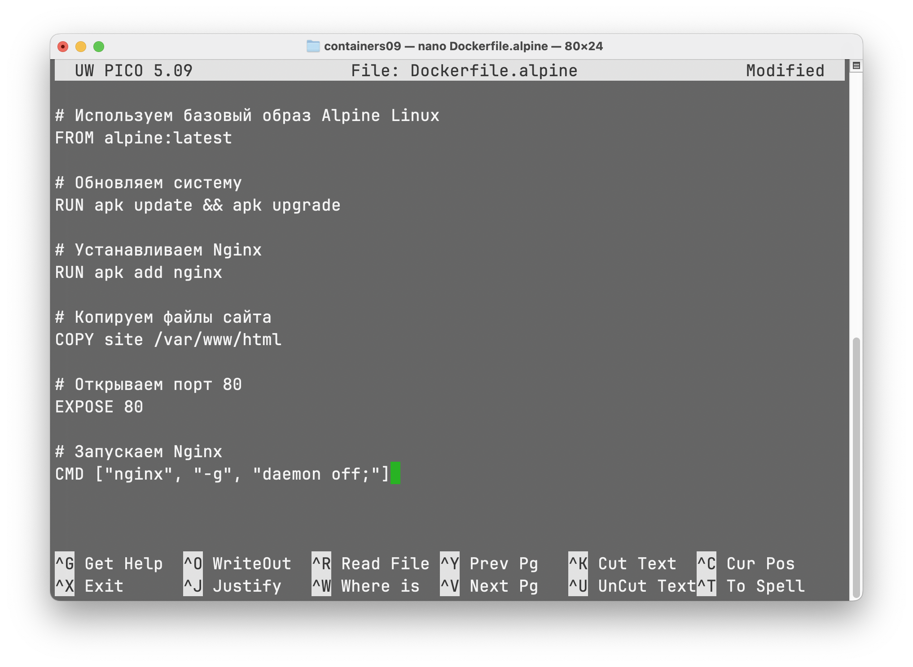
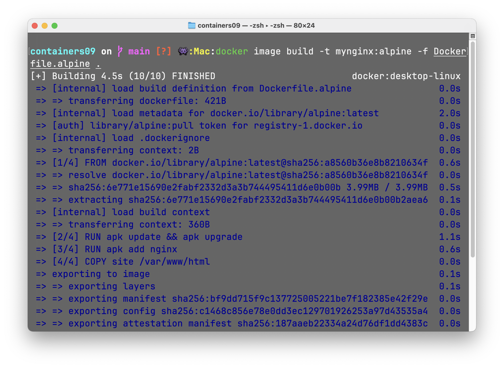
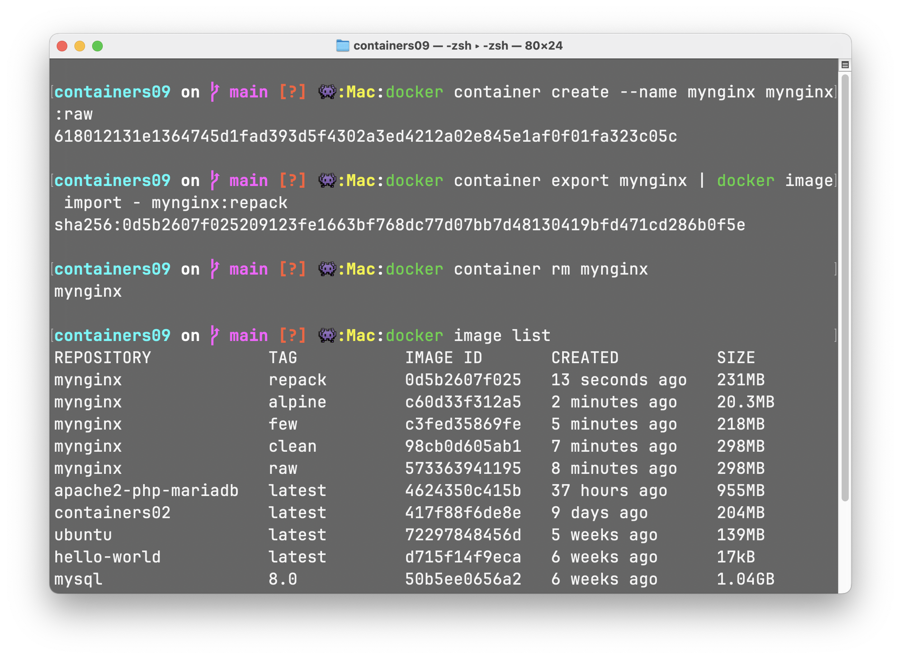

# Лабораторная работа №9: Оптимизация Docker-образов

---

## Студент

- **Имя и Фамилия**: Никита Савка  
- **Группа**: I2302  
- **Платформа**: macOS (Apple M3)  
- **Дата выполнения**: 10 марта 2025  

---

## Цель работы

Основная цель – сравнить различные методы оптимизации Docker-образов и проанализировать, как эти методы влияют на итоговый размер образа.  

**Конкретные методы оптимизации**:  
1. Удаление неиспользуемых зависимостей и временных файлов.  
2. Уменьшение количества слоёв (объединение нескольких инструкций RUN в одну).  
3. Использование минимального базового образа (alpine).  
4. Перепаковка (repacking) образа.  
5. Сочетание всех методов.  

---

## Задание

1. Создать репозиторий `containers09` и скопировать его (клон) на свой компьютер.  
2. В папке `containers09` создать папку `site`, положить туда файлы простого сайта (HTML, CSS, JS).  
3. Создать и собрать 7 вариантов образа:  
   - `mynginx:raw` (Dockerfile.raw)  
   - `mynginx:clean` (Dockerfile.clean)  
   - `mynginx:few` (Dockerfile.few)  
   - `mynginx:alpine` (Dockerfile.alpine)  
   - `mynginx:repack` (перепаковка mynginx:raw)  
   - `mynginx:minx` (Dockerfile.min – все методы)  
   - `mynginx:min` (перепаковка mynginx:minx)  
4. Вывести сравнение размеров (таблицу) и ответить на вопросы:  
   - Какой метод оптимизации наиболее эффективен?  
   - Почему очистка кэша пакетов в отдельном слое не уменьшает размер образа?  
   - Что такое перепаковка образа?  

---

## Подготовка репозитория

### 1. Создание репозитория containers09 на GitHub  
1. Захожу в свой GitHub-аккаунт и нажимаю кнопку **New repository**.  
2. Ввожу название `containers09`, нажимаю **Create repository**.  
- **Скриншот**: Создание репозитория  
       

### 2. Клонирование репозитория  
1. В терминале на Mac перехожу в папку, где храню проекты, например:  
   ```bash
   cd ~/projects
   ```  
2. Выполняю команду:  
   ```bash
   git clone https://github.com/<МОЙ_ПОЛЬЗОВАТЕЛЬ_GITHUB>/containers09.git
   cd containers09
   ```  
   - *Разбор*:  
     - `git clone ...` – копирует удалённый репозиторий `containers09` на мой девайс.  
     - `cd containers09` – перехожу в только что клонированную папку.  

**Итог**: Репозиторий готов к работе.  

---

## Создание сайта в папке site

1. Делаю папку `site`:  
   ```bash
   mkdir site
   ```  

2. Создаю 3 файла (пример):  
   ```bash
   touch site/index.html
   touch site/styles.css
   touch site/script.js
   ```  

3. Заполняю их содержимым благодаря команде `nano`:
   - **`index.html`**:  
```html
     <!DOCTYPE html>
    <html>
    <head>
        <meta charset="UTF-8" />
        <title>Demo Site</title>
        <link rel="stylesheet" href="styles.css" />
    </head>
    <body>
        <h1>Hello from Docker!</h1>
        <p>Some text here</p>
        
        <button class="box">Hover me</button>

        <script src="script.js"></script>
    </body>
    </html>
```  

   - **`styles.css`**:  
```css
     body {
    font-family: sans-serif;
    text-align: center;
    background: #f0f0f0;
    }
    .box {
    margin: 40px auto;
    width: 150px;
    height: 150px;
    background: #3498db;
    transition: transform 0.3s;
    }
    .box:hover {
    transform: scale(1.2) rotate(10deg);
    }
```  

   - **`script.js` (простейший JS)**:  
```javascript
     const box = document.querySelector('.box');

    box.addEventListener('click', () => {
    alert('Hello from JavaScript!');
    });

    box.addEventListener('mouseenter', () => {
    console.log('Hover detected!');
    });

```  

4. Проверка:  
   ```bash
   ls -la site
   ```  
   – вижу `index.html`, `styles.css`, `script.js`.  

**Итог**: Папка `site` содержит простой сайт с анимацией.  

- **Скриншот**: Папка site 
       

---

## 1. Dockerfile.raw → mynginx:raw

1. Создаю `Dockerfile.raw`:  
   ```bash
   touch Dockerfile.raw
   nano Dockerfile.raw
   ```  

2. Записываю код (по заданию):  
   ```dockerfile
   FROM ubuntu:latest

   RUN apt-get update && apt-get upgrade -y
   RUN apt-get install -y nginx

   COPY site /var/www/html

   EXPOSE 80
   CMD ["nginx", "-g", "daemon off;"]
   ```  
   - *Разбор*:  
     - `FROM ubuntu:latest` – базовый образ Ubuntu.  
     - Две команды `RUN`: одна обновляет систему, другая ставит nginx.  
     - `COPY site /var/www/html` – наши файлы сайта.  
     - `EXPOSE 80` – открываем 80 порт.  
     - `CMD ["nginx", "-g", "daemon off;"]` – запускаем nginx.  

3. Сборка образа:  
   ```bash
   docker image build -t mynginx:raw -f Dockerfile.raw .
   ```  
   - `-t mynginx:raw` – имя:тег = `mynginx:raw`.  
   - `-f Dockerfile.raw` – указываем свой Dockerfile.  
   - `.` – контекст сборки (текущая папка).  

- **Скриншот**: Образ mynginx:raw 
     
      

4. Проверка:  
   ```bash
   docker image list
   ```  
   – вижу `mynginx:raw`, занял ~298MB. 

**Итог**: Образ `mynginx:raw` собран.  

- **Скриншот**: Образ mynginx:raw 
      

---

## 2. Удаление неиспользуемых зависимостей (Dockerfile.clean)

1. Создаю `Dockerfile.clean`:  
   ```bash
   touch Dockerfile.clean
   nano Dockerfile.clean
   ```  

2. Код:  
   ```dockerfile
   FROM ubuntu:latest

   RUN apt-get update && apt-get upgrade -y
   RUN apt-get install -y nginx

   RUN apt-get clean && rm -rf /var/lib/apt/lists/* /tmp/* /var/tmp/*

   COPY site /var/www/html

   EXPOSE 80
   CMD ["nginx", "-g", "daemon off;"]
   ```  
   - *Разбор*:  

    🔹 `FROM ubuntu:latest`
	•	Этот шаг определяет базовый образ, на основе которого будет создаваться контейнер.
	•	ubuntu:latest означает, что мы используем последнюю доступную версию Ubuntu.
	•	Если позднее выйдет новая версия Ubuntu, при сборке образа автоматически будет использоваться она.

    🔹 `RUN apt-get update && apt-get upgrade -y`
        •	apt-get update обновляет список доступных пакетов и их версий.
        •	apt-get upgrade -y автоматически обновляет все пакеты системы до последних доступных версий.
        •	Использование флага -y позволяет пропустить подтверждение установки.

    🔹 `RUN apt-get install -y nginx`
        •	Эта команда устанавливает веб-сервер Nginx.
        •	Флаг -y позволяет установить пакет без запроса подтверждения от пользователя.

    🔹 `RUN apt-get clean && rm -rf /var/lib/apt/lists/* /tmp/* /var/tmp/*`

    Этот шаг отвечает за удаление ненужных данных, чтобы уменьшить размер образа:
        •	apt-get clean очищает кеш пакетов, хранящийся в /var/cache/apt/archives/.
        •	rm -rf /var/lib/apt/lists/* удаляет файлы индексов пакетов, которые больше не нужны после установки программ.
        •	rm -rf /tmp/* /var/tmp/* удаляет временные файлы, созданные в процессе работы системы.

    ❗ Важно: Если очистка кеша выполняется в отдельном слое (как здесь), предыдущие слои все равно сохраняются в истории образа, что не приведет к уменьшению его реального размера. Поэтому, чтобы действительно уменьшить размер образа, этот шаг лучше объединять с установкой пакетов в одной команде RUN (см. Dockerfile.few).

    🔹 `COPY site /var/www/html`
        •	Копирует содержимое локальной папки site в контейнер, в директорию /var/www/html, откуда Nginx сможет обслуживать файлы.

    🔹 `EXPOSE 80`
        •	Открывает порт 80, который будет использоваться для HTTP-запросов.

    🔹 `CMD ["nginx", "-g", "daemon off;"]`
        •	Эта команда запускает Nginx в фоновом режиме, чтобы контейнер не завершал свою работу после старта.

    - **Скриншот**: Образ mynginx:raw  
     

3. Сборка:  
   ```bash
   docker image build -t mynginx:clean -f Dockerfile.clean .
   ```  
    *Разбор*: 

   	•	`docker image build` — команда для создания образа. 

	•	`-t mynginx:clean` — задаем имя и тег образа (mynginx:clean).

	•	`-f Dockerfile.clean` — указываем, какой именно Dockerfile использовать.

	•	`.` — означает, что контекст сборки находится в текущей директории.
    
 - **Скриншот**: Образ mynginx:clean 
      

4. Сравнение:  
   ```bash
   docker image list
   ```  
   – Размер похож на `mynginx:raw`, так как очистка кеша идёт в новом слое.  
 - **Скриншот**: Образ mynginx:clean 
      

**Итог**: `mynginx:clean` собран и занимает 298MB.  

---

## 3. Уменьшение количества слоёв (Dockerfile.few)

1. `Dockerfile.few`:  
   ```bash
   touch Dockerfile.few
   nano Dockerfile.few
   ```  

2. Вставляю:  
   ```dockerfile
   FROM ubuntu:latest

   RUN apt-get update && apt-get upgrade -y && \
       apt-get install -y nginx && \
       apt-get clean && rm -rf /var/lib/apt/lists/* /tmp/* /var/tmp/*

   COPY site /var/www/html

   EXPOSE 80
   CMD ["nginx", "-g", "daemon off;"]
   ```  
   - *Разбор*: Объединил всё в один `RUN`, чтобы не «создавать» много слоёв.  

3. Сборка:  
   ```bash
   docker image build -t mynginx:few -f Dockerfile.few .
   ```  
 - **Скриншот**: Образ mynginx:few 
      

4. Проверка:  
   ```bash
   docker image list
   ```  
   – Размер снизился, до ~218MB.  
 - **Скриншот**: Образ mynginx:few 
      

**Итог**: `mynginx:few` – меньше слоёв, меньше размер.  

---

## 4. Минимальный базовый образ (Dockerfile.alpine)

1. Создаю `Dockerfile.alpine`:  
   ```bash
   touch Dockerfile.alpine
   nano Dockerfile.alpine
   ```  

2. Код:  
   ```dockerfile
   FROM alpine:latest

   RUN apk update && apk upgrade
   RUN apk add nginx

   COPY site /var/www/html

   EXPOSE 80
   CMD ["nginx", "-g", "daemon off;"]
   ```  
   - *Разбор*:  
     - `apk add nginx` – Alpine использует пакетный менеджер apk.  
 - **Скриншот**: Образ mynginx:alpine 
      

3. Сборка:  
   ```bash
   docker image build -t mynginx:alpine -f Dockerfile.alpine .
   ```  
 - **Скриншот**: Образ mynginx:alpine 
      

4. Проверка:  
   ```bash
   docker image list
   ```  
   – Обычно видим около 20MB.  
 - **Скриншот**: Образ mynginx:alpine 
      

**Итог**: `mynginx:alpine` весьма небольшой.  

---

## 5. Перепаковка образа (mynginx:raw → mynginx:repack)

1. Создаю временный контейнер:  
   ```bash
   docker container create --name mynginx mynginx:raw
   ```  

2. Экспорт → Импорт:  
   ```bash
   docker container export mynginx | docker image import - mynginx:repack
   ```  
   - Экспортируем слой контейнера и импортируем как новый образ `mynginx:repack`.  

3. Удаляю контейнер:  
   ```bash
   docker container rm mynginx
   ```  

4. Смотрю список:  
   ```bash
   docker image list
   ```  
   – Видим `mynginx:repack`, может на несколько мегабайт меньше.  
 - **Скриншот**: Образ mynginx:repack 
      

**Итог**: `mynginx:repack` – однослойный образ, перепакованный из `raw`.  

---

## 6. Использование всех методов (Dockerfile.min → mynginx:minx)

1. Создаю `Dockerfile.min`:  
   ```bash
   touch Dockerfile.min
   nano Dockerfile.min
   ```  

2. Код:  
   ```dockerfile
   FROM alpine:latest

   RUN apk update && apk upgrade && \
       apk add nginx && \
       rm -rf /var/cache/apk/*

   COPY site /var/www/html

   EXPOSE 80
   CMD ["nginx", "-g", "daemon off;"]
   ```  
   - *Разбор*:  
     - Alpine – минимальный.  
     - Сразу после установки nginx удаляем кеш `rm -rf /var/cache/apk/*`.  
     - Объединяем всё в одну инструкцию `RUN`.  
 - **Скриншот**: Образ mynginx:minx
      

3. Сборка `mynginx:minx`:  
   ```bash
   docker image build -t mynginx:minx -f Dockerfile.min .
   ```  
   - Ждём, проверяем размер ~15–16MB.  
- **Скриншот**: Образ mynginx:minx
      

**Итог**: `mynginx:minx` – максимально оптимизированный образ.  

---

## 7. Перепаковка mynginx:minx → mynginx:min

1. Создаю контейнер:  
   ```bash
   docker container create --name mynginx_temp mynginx:minx
   ```  

2. Экспортирую/Импортирую:  
   ```bash
   docker container export mynginx_temp | docker image import - mynginx:min
   ```  

3. Удаляю контейнер:  
   ```bash
   docker container rm mynginx_temp
   ```  

4. Проверяю:  
   ```bash
   docker image list
   ```  
   – `mynginx:min` может быть чуть меньше, например, ~15.1MB.  
- **Скриншот**: Образ mynginx:min
      

**Итог**: Образ `mynginx:min` – перепакованный вариант, где история слоёв исчезла.  

---

## Сравнение размеров образов

Выполняю команду:  
```bash
docker image list
```  

Получаю (примерные цифры):  

| Образ          | Примерный размер |
|----------------|------------------|
| mynginx:raw    | 298 MB           |
| mynginx:clean  | 298 MB           |
| mynginx:few    | 218 MB           |
| mynginx:alpine | 20.3 MB          |
| mynginx:repack | 231 MB           |
| mynginx:minx   | 15.3 MB          |
| mynginx:min    | 15.1 MB          |

---

## Ответы на вопросы

1. **Какой метод оптимизации образов вы считаете наиболее эффективным?**  
   Наибольший выигрыш даёт переход на минимальный базовый образ (alpine) + уменьшение количества слоёв (объединение команд RUN). Перепаковка тоже полезна, но ключевой эффект – именно «лёгкий» базовый образ + минимальное число слоёв.  

2. **Почему очистка кэша пакетов в отдельном слое не уменьшает размер образа?**  
   Каждая инструкция RUN создаёт новый слой, а предыдущий слой по-прежнему хранит все данные, включая кеш. Если очистка идёт в отдельном слое, кеш уже «записан» в предыдущий слой. Поэтому нужно объединять установку пакетов и очистку кеша в одном RUN, чтобы кеш не попал ни в один слой окончательно.  

3. **Что такое перепаковка образа?**  
   Перепаковка (repacking) – это процесс экспортирования файловой системы контейнера и импортирования её обратно в новый образ. Это убирает историю слоёв, уменьшая итоговый размер за счёт создания «чистого» однослойного образа.  

---

## Выводы

- `mynginx:raw` (Ubuntu, ничего не удаляем) ~300MB.  
- `mynginx:clean` (Ubuntu, удаляем кэш в отдельном слое) – размер остаётся почти тем же, потому что история слоёв не обрезана.  
- `mynginx:few` (Ubuntu, объединение команд) – уменьшение слоёв даёт заметный эффект (218MB).  
- `mynginx:alpine` – переход на Alpine сразу сократил размер до ~20MB.  
- `mynginx:repack` – перепаковка убрала историю слоёв, немного уменьшив размер `mynginx:raw`.  
- `mynginx:minx` – все методы (Alpine + уменьшение слоёв + очистка сразу), вышло ~15MB.  
- `mynginx:min` – перепакованный `minx`, ещё чуть меньше (~15.1MB).  

### Итоговый вывод

Наибольший вклад в оптимизацию вносит использование минимального образа Alpine и правильное объединение инструкций RUN для уменьшения слоёв. Сама по себе очистка кэша в отдельном слое не уменьшает размер, так как предыдущие слои сохраняют скачанные данные. Перепаковка образа тоже даёт эффект, удаляя историю слоёв, но принципиально он не так велик, как переход на Alpine и минимальное число слоёв.  

Таким образом, чтобы добиться оптимального результата, нужно использовать Alpine, объединять команды в один RUN, сразу после установки чистить кеш, а в конце (при необходимости) перепаковывать образ в однослойный.  

---

## Источники

1. **Docker Documentation**. *Docker Documentation*.  
   Доступно на: [https://docs.docker.com/](https://docs.docker.com/)  
   (Дата обращения: 06.03.2025)  

2. **Nginx Documentation**. *Nginx Documentation*.  
   Доступно на: [https://nginx.org/en/docs/](https://nginx.org/en/docs/)  
   (Дата обращения: 06.03.2025)  

3. **Alpine Linux Wiki**. *Alpine Linux Package Management*.  
   Доступно на: [https://wiki.alpinelinux.org/wiki/Alpine_Linux_package_management](https://wiki.alpinelinux.org/wiki/Alpine_Linux_package_management)  
   (Дата обращения: 06.03.2025)  

4. **MariaDB Knowledge Base**. *MariaDB KB*.  
   Доступно на: [https://mariadb.com/kb/en/](https://mariadb.com/kb/en/)  
   (Дата обращения: 06.03.2025)  

5. **Supervisor Documentation**. *Supervisor Documentation*.  
   Доступно на: [http://supervisord.org/](http://supervisord.org/)  
   (Дата обращения: 06.03.2025)  